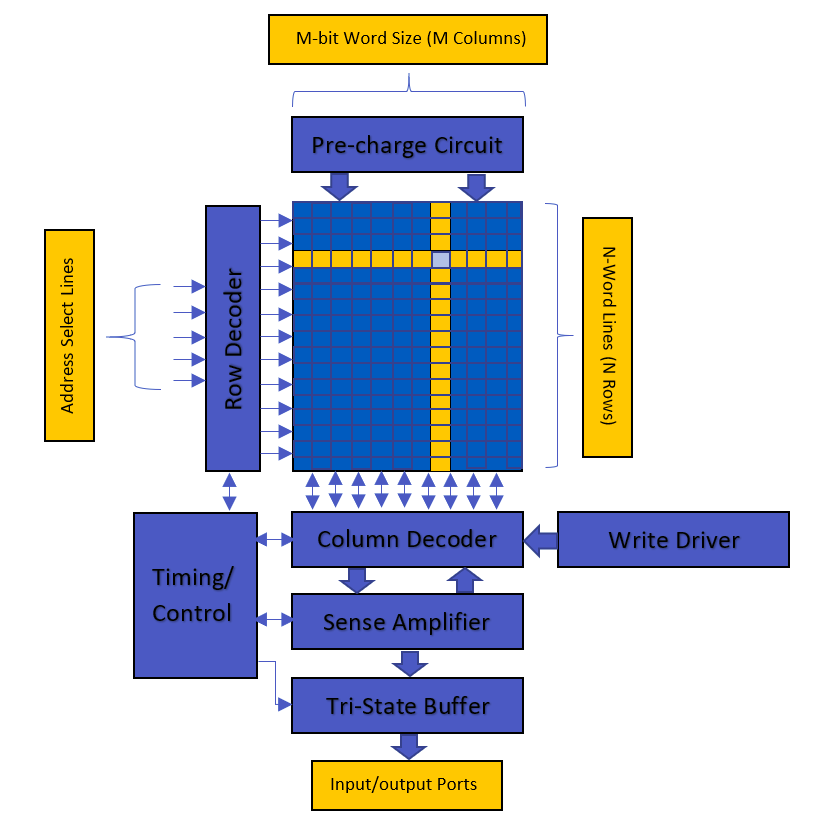

# SRAM

## Table Of Contents
- [SRAM Design](https://github.com/ReuelReuben/vsdSRAM#sram-design)
- [Basic Architectural Block Diagram](https://github.com/ReuelReuben/vsdSRAM#basic-architectural-block-diagram)
- [Pre-Layout](https://github.com/ReuelReuben/vsdSRAM#pre-layout)
  - [6T Memory cell](https://github.com/ReuelReuben/vsdSRAM#6t-memory-cell)
  - [Sense Amplifier](https://github.com/ReuelReuben/vsdSRAM#sense-amplifier)
  - [Write Driver](https://github.com/ReuelReuben/vsdSRAM#write-driver)
  - [Tri-State Buffer](https://github.com/ReuelReuben/vsdSRAM#tri-state-buffer)
  - [Pre-Charge Circuit](https://github.com/ReuelReuben/vsdSRAM#pre-charge-circuit)
- [Post-Layout](https://github.com/ReuelReuben/SRAM#pre-layout-inputoutput-waveforms-of-individual-custom-cells)
  - [6T Memory cell](https://github.com/ReuelReuben/vsdSRAM#6t-memory-cell-1)
  - [Sense Amplifier](https://github.com/ReuelReuben/vsdSRAM#sense-amplifier-1)
  - [Write Driver](https://github.com/ReuelReuben/vsdSRAM#write-driver-1)
  - [Tri-State Buffer](https://github.com/ReuelReuben/vsdSRAM#tri-state-buffer-1)
  - [Pre-Charge Circuit](https://github.com/ReuelReuben/vsdSRAM#pre-charge-circuit-1)
  - [Positive Edge D Flip Flop](https://github.com/ReuelReuben/vsdSRAM#positive-edge-d-flip-flop)
- [Integrated Circuit](https://github.com/ReuelReuben/vsdSRAM#integrated-circuit)
- [Installing And Simulating On NgSpice](https://github.com/ReuelReuben/vsdSRAM#installing-and-simulating-on-ngspice)
- [Future Works](https://github.com/ReuelReuben/vsdSRAM/blob/master/Readme.md#future-works)
- [Contributors](https://github.com/ReuelReuben/vsdSRAM#contributors)
- [Acknowlegedgements](https://github.com/ReuelReuben/vsdSRAM#acknowlegedgements)
- [Contact Information](https://github.com/ReuelReuben/vsdSRAM#contact-information)

# SRAM Design
This Project mainly focuses on the design of 4kB SRAM memory using opensource memory compiler **OpenRAM**. For the design of custom memory array, memory compiler takes in SPICE netlists, Layout files of the custom cells designed and few other parameters and generates a SRAM memory array.

SRAM Specs - Memory Size of **4kBytes** with operating voltage of **1.8V** and access time of less than **2.5ns**. 
 
- For a better understanding of working, implementation and applications of SRAM please [click here](https://github.com/ReuelReuben/SRAM/blob/master/Documentation/SRAM.docx)

- For more information on OpenRAM please [click here](https://github.com/VLSIDA/OpenRAM.git)

# Basic Architectural Block Diagram

# Pre-Layout

**Note** -Below circuit diagrams have the test input's connected for Simulations. 

## 6T Memory cell

**Circuit Diagram**

**Simulation**

**For Pre Layout Simulation please** [click here](https://github.com/ReuelReuben/vsdSRAM#6t-memory-cell-2)

**Butterfly Curve**

**For Simulation please** [click here](https://github.com/ReuelReuben/vsdSRAM#butterfly-curve)

The **Signal to Noise Margin(SNM)** for SRAM Cell = **0.63** 

It can be extracted by nesting the largest possible square in the two voltage transfer curves (VTC) of the involved CMOS inverters. The SNM is defined as the side-length of the square.

## Sense Amplifier

**Circuit Diagram**

**Simulation-1**

**For Pre Layout Simulation please** [click here](https://github.com/ReuelReuben/vsdSRAM#sense-amplifier-2)

**Simulation-2**

## Write Driver

**Circuit Diagram**

**Simulation**

**For Pre Layout Simulation please** [click here](https://github.com/ReuelReuben/vsdSRAM#write-driver-2)

## Tri-State Buffer

.png)

**Circuit Diagram**

**Simulation-1**

**For Pre Layout Simulation please** [click here](https://github.com/ReuelReuben/vsdSRAM#tri-state-buffer-2)

**Simulation-2**

## Pre-Charge Circuit

**Circuit Diagram**

**Simulation**

**For Pre Layout Simulation please** [click here](https://github.com/ReuelReuben/vsdSRAM#pre-charge-circuit-2)

# Post-Layout

## 6T Memory cell

**Layout**

**Simulation**

**For Post Layout Simulation please** [click here](https://github.com/ReuelReuben/vsdSRAM#6t-memory-cell-3)

## Sense Amplifier

**Layout**

**Simulation-1**

**For Post Layout Simulation please** [click here](https://github.com/ReuelReuben/vsdSRAM#sense-amplifier-3)

**Simulation-2**

## Write Driver

**Layout**

**Simulation**

**For Post Layout Simulation please** [click here](https://github.com/ReuelReuben/vsdSRAM#write-driver-3)

## Tri-State Buffer

**Layout**

**Simulation-1**

**For Post Layout Simulation please** [click here](https://github.com/ReuelReuben/vsdSRAM#tri-state-buffer-3)

**Simulation-2**

## Pre-Charge Circuit

**Layout**

**Simulation**

**For Post Layout Simulation please** [click here](https://github.com/ReuelReuben/vsdSRAM#pre-charge-circuit-3)

## Positive Edge D Flip Flop

**Layout**

**Simulation**

**For Post Layout Simulation please** [click here](https://github.com/ReuelReuben/vsdSRAM#positive-edge-d-flip-flop-1)

# Integrated Circuit

## Circuit Diagram

# Pre-Layout Input/Output Waveforms Of Integrated Circuit

**For Pre Layout Simulation please** [click here](https://github.com/ReuelReuben/vsdSRAM#integrated-circuit-1)

## Input Waveforms Of Integrated Circuit

## Output Waveforms Of Integrated Circuit

## Layout

# Post-Layout Input/Output Waveforms Of Integrated Circuit

**For Post Layout Simulation please** [click here](https://github.com/ReuelReuben/vsdSRAM#integrated-circuit-2)

## Input Waveforms Of Integrated Circuit

## Output Waveforms Of Integrated Circuit

# Installing And Simulating On NgSpice

## A. Installing NgSpice

1. Open your Terminal  

2. Type the following to install NgSpice

`sudo apt-get install ngspice`

## B. Go To Pre-Layout Simulations Directory

1. First dowload GitHub packages

`sudo apt install -y git`

2. Clone GitHub Repository to Home Directory

`git clone https://github.com/ReuelReuben/SRAM.git`

3. Change Directory to PreLayout

`cd ~/SRAM/Spice/PreLayout`

## Pre-Layout Simulations

## 6T Memory cell

After Doing Steps [A.](https://github.com/ReuelReuben/SRAM#a-installing-ngspice) and [B.](https://github.com/ReuelReuben/vsdSRAM#b-go-to-pre-layout-simulations-directory) directly Copy below Command and paste in terminal for Pre-Layout simulations

`ngspice 6TMemCell.cir.out`

## Sense Amplifier

After Doing Steps [A.](https://github.com/ReuelReuben/SRAM#a-installing-ngspice) and [B.](https://github.com/ReuelReuben/SRAM#b-go-to-pre-layout-simulations-directory) directly Copy below Command and paste in terminal for Pre-Layout simulations

`ngspice SenseAmplifier.cir.out`

## Write Driver

After Doing Steps [A.](https://github.com/ReuelReuben/SRAM#a-installing-ngspice) and [B.](https://github.com/ReuelReuben/SRAM#b-go-to-pre-layout-simulations-directory) directly Copy below Command and paste in terminal for Pre-Layout simulations

`ngspice WriteDriver.cir.out`

## Tri-State Buffer

After Doing Steps [A.](https://github.com/ReuelReuben/SRAM#a-installing-ngspice) and [B.](https://github.com/ReuelReuben/SRAM#b-go-to-pre-layout-simulations-directory) directly Copy below Command and paste in terminal for Pre-Layout simulations

`ngspice Trigate.cir.out`

## Pre-Charge Circuit

After Doing Steps [A.](https://github.com/ReuelReuben/SRAM#a-installing-ngspice) and [B.](https://github.com/ReuelReuben/SRAM#b-go-to-pre-layout-simulations-directory) directly Copy below Command and paste in terminal for Pre-Layout simulations

`ngspice PrechargeCell.cir.out`

## Integrated Circuit

After Doing Steps [A.](https://github.com/ReuelReuben/SRAM#a-installing-ngspice) and [B.](https://github.com/ReuelReuben/SRAM#b-go-to-pre-layout-simulations-directory) directly Copy below Command and paste in terminal for Pre-Layout simulations

`ngspice IntegrationTest.cir`

## ButterFly Curve

After Doing Steps [A.](https://github.com/ReuelReuben/SRAM#a-installing-ngspice) and [B.](https://github.com/ReuelReuben/SRAM#b-go-to-pre-layout-simulations-directory) directly Copy below Command and paste in terminal for Pre-Layout simulations

`ngspice BFcurve.cir.out`

## B. Go To Post-Layout Simulations Directory

Change Directory to PostLayout

1. `cd`

2. `cd ~/SRAM/Spice/PostLayout`

## Post-Layout Simulations

## 6T Memory cell

After Doing Steps [A.](https://github.com/ReuelReuben/SRAM#a-installing-ngspice) and [B.](https://github.com/ReuelReuben/vsdSRAM#b-go-to-post-layout-simulations-directory) directly Copy below Command and paste in terminal for Post-Layout simulations

`ngspice S6TMemCell.spice`

## Sense Amplifier

After Doing Steps [A.](https://github.com/ReuelReuben/SRAM#a-installing-ngspice) and [B.](https://github.com/ReuelReuben/vsdSRAM#b-go-to-post-layout-simulations-directory) directly Copy below Command and paste in terminal for Post-Layout simulations

`ngspice SenseAmplifier.spice`

## Write Driver

After Doing Steps [A.](https://github.com/ReuelReuben/SRAM#a-installing-ngspice) and [B.](https://github.com/ReuelReuben/vsdSRAM#b-go-to-post-layout-simulations-directory) directly Copy below Command and paste in terminal for Post-Layout simulations

`ngspice WriteDriver.spice`

## Tri-State Buffer

After Doing Steps [A.](https://github.com/ReuelReuben/SRAM#a-installing-ngspice) and [B.](https://github.com/ReuelReuben/vsdSRAM#b-go-to-post-layout-simulations-directory) directly Copy below Command and paste in terminal for Post-Layout simulations

`ngspice Tri-GateBuffer.spice`

## Pre-Charge Circuit

After Doing Steps [A.](https://github.com/ReuelReuben/SRAM#a-installing-ngspice) and [B.](https://github.com/ReuelReuben/vsdSRAM#b-go-to-post-layout-simulations-directory) directly Copy below Command and paste in terminal for Post-Layout simulations

`ngspice  Pre-Charge.spice `

## Integrated Circuit

After Doing Steps [A.](https://github.com/ReuelReuben/SRAM#a-installing-ngspice) and [B.](https://github.com/ReuelReuben/vsdSRAM#b-go-to-post-layout-simulations-directory) directly Copy below Command and paste in terminal for Post-Layout simulations

`ngspice IntegrationTest.spice `

## Positive Edge D Flip Flop

After Doing Steps [A.](https://github.com/ReuelReuben/SRAM#a-installing-ngspice) and [B.](https://github.com/ReuelReuben/vsdSRAM#b-go-to-post-layout-simulations-directory) directly Copy below Command and paste in terminal for Post-Layout simulations

`ngspice dff.spice  `

# Future Works

- Porting the above designs to OpenRam Compiler and Compiling the SRAM.
- Porting all the designs to sky130 technology node. 

# Contributors

- Reuel Reuben
- Kunal Ghosh
- Philipp Gühring

# Acknowlegedgements

- Kunal Ghosh, Co-founder, VSD Corp. Pvt. Ltd.
- Philipp Gühring, Software Architect, LibreSilicon Assocation

# Contact Information

- Reuel Reuben, Undergraduate Student, BVPCOE reuel992000@gmail.com
- Kunal Ghosh, Director, VSD Corp. Pvt. Ltd. kunalghosh@gmail.com
- Philipp Gühring, Software Architect, LibreSilicon Assocation pg@futureware.at
